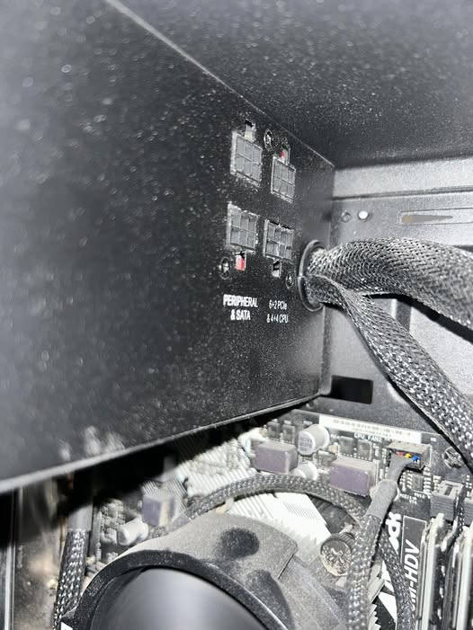

# Conector PCIe 6/8 pines

**Descripción breve:** Conector auxiliar de alimentación para tarjetas gráficas y otros dispositivos PCIe de alto consumo.
**Pines/Carriles/Voltajes/Velocidad:** 6 u 8 pines, 12 V.
**Uso principal:** Suministro de energía adicional a GPUs y tarjetas PCIe.
**Compatibilidad actual:** Alta

## Identificación física
-Conector rectangular de 6 o 8 pines (a veces 6+2).
-Ubicado en el extremo superior de las tarjetas gráficas.
-Cables amarillos y negros procedentes de la PSU.

## Notas técnicas
-PCIe 6 pines: hasta 75 W adicionales.
-PCIe 8 pines: hasta 150 W adicionales.
-Algunos adaptadores combinan varios conectores para gráficas de alta potencia.

## Fotos

## Fuente
https://www.ultralibrarian.com/blog/power-supply-pcie-power-pin-layout-best-practices
http://jongerow.com/PCIe/index.html