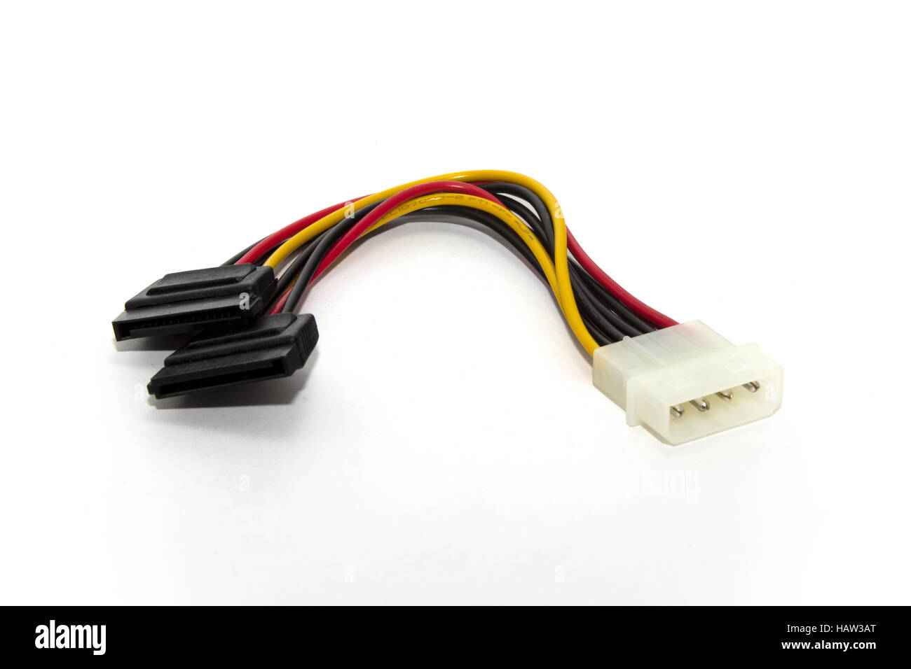

# Conector SATA Power

**Descripción breve:** Conector plano de energía usado para alimentar discos duros, SSDs y unidades ópticas modernas.
**Pines/Carriles/Voltajes/Velocidad:** 15 pines, 3.3 V / 5 V / 12 V.
**Uso principal:** Suministro de energía a dispositivos de almacenamiento SATA.
**Compatibilidad actual:** Alta

## Identificación física
-Conector plano, delgado, con forma de “L” invertida.
-Cable flexible con 15 contactos metálicos.
-Se encuentra en las salidas de la fuente de alimentación.

## Notas técnicas
-Sustituyó al conector Molex en unidades modernas.
-Admite hot-swap en sistemas que lo soportan.
-No intercambiable con el conector de datos SATA (aunque similar en forma).

## Fotos

## Fuente
https://en.wikipedia.org/wiki/SATA#SATA_power_connectors
https://tripplite.eaton.com/learn/sata-cables-and-speeds