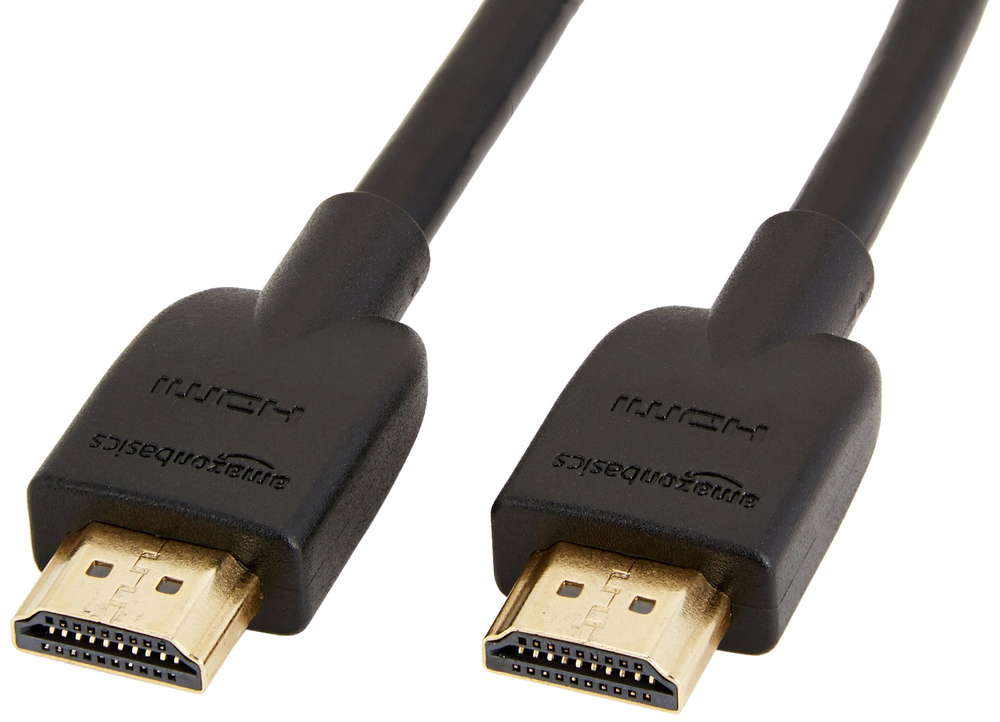

# Conector externo: HDMI 2.1

**Descripción breve:** Salida de vídeo y audio digital hasta 8K, usada en monitores y TVs modernos.
**Pines/Carriles/Voltajes/Velocidad:** 19 pines · hasta 48 Gb/s · HDR / 8K / 60-120 Hz
**Uso principal:** Conexión de monitores, TVs y proyectores
**Compatibilidad actual:** Alta

## Identificación física
-Conector rectangular con forma trapezoidal.

-Panel trasero de placas base, gráficas y televisores.

## Notas técnicas
-Soporta eARC, Dynamic HDR y tasas de refresco altas.

-Retrocompatible con HDMI 1.4 / 2.0.

## Fotos

## Fuentes
- https://www.profesionalreview.com/conectores-y-puertos-de-un-pc-guia-completa