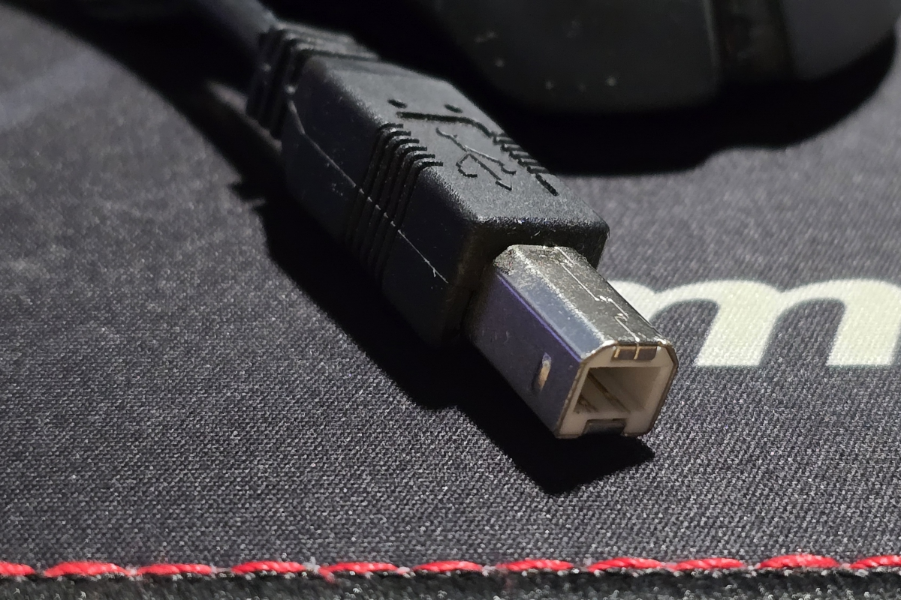

# Conector externo: USB-B

**Descripción breve:** Puerto cuadrado, habitual en impresoras, escáneres y periféricos.
**Pines/Carriles/Voltajes/Velocidad:** 4 pines · hasta 480 Mb/s (USB 2.0) / 5 Gb/s (USB 3.0)
**Uso principal:** Conexión de impresoras y periféricos al PC
**Compatibilidad actual:** Media

## Identificación física
-Conector cuadrado con bordes biselados superiores.

-Ubicado en periféricos, no en PCs.

## Notas técnicas
- No reversible.

-Compatible con USB 1.1 / 2.0.

-Adaptadores permiten conexión a USB-A.

## Fotos

## Fuentes
- https://edraw.wondershare.es/diagrama-de-cableado-usb.html